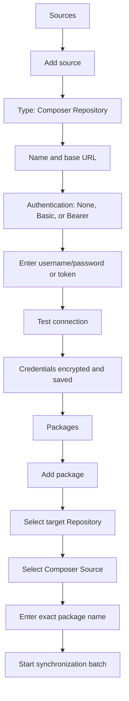
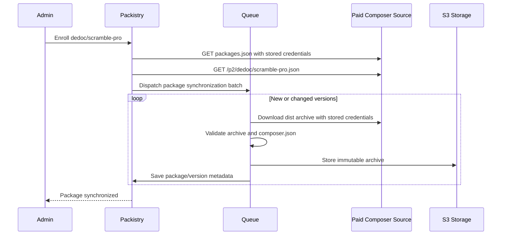
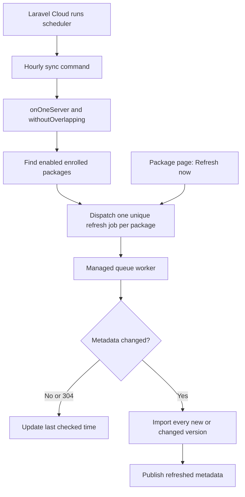
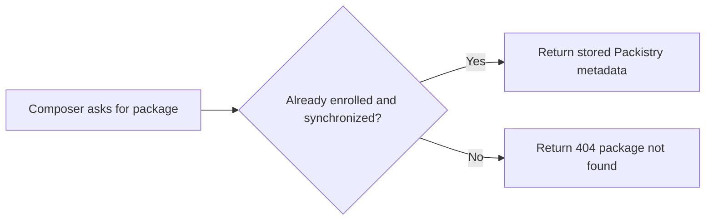
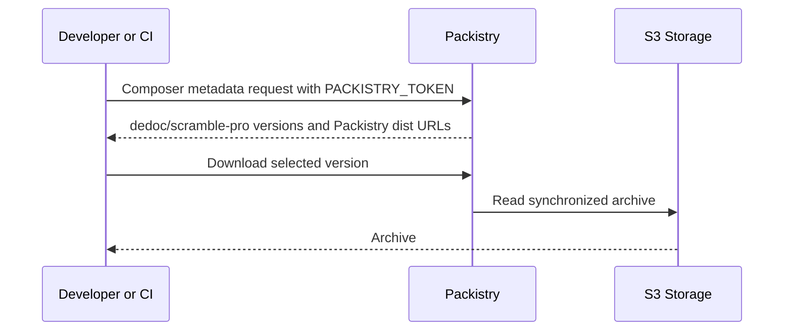

# Setup And Runtime Flow

## Concepts In The UI

| Packistry concept | Purpose | Example |
| --- | --- | --- |
| Repository | Downstream collection consumed by developers and CI. | `Pyle` at `https://packistry.pylesoft.com` |
| Source | Upstream location from which Packistry imports packages. | `Scramble Pro` at `https://satis.dedoc.co` |
| Package | A named Composer package enrolled from a source into a repository. | `dedoc/scramble-pro` |

The existing `Pyle` repository is reused. A separate repository is necessary only when downstream access must be isolated.

## Administrator Setup



For Scramble Pro:

| Field | Value |
| --- | --- |
| Name | `Scramble Pro` |
| Type | `Composer Repository` |
| URL | `https://satis.dedoc.co` |
| Authentication | `HTTP Basic` |
| Username | Scramble account email |
| Password | Scramble API token |
| Target repository | Existing `Pyle` repository |
| Package | `dedoc/scramble-pro` |

The initial consumer must also satisfy Scramble Pro's package compatibility requirement. At the time of the supplied installation guide, that means `dedoc/scramble` `^0.13.42` or newer alongside `dedoc/scramble-pro` `^0.9.15`; these are consumer constraints rather than mirror configuration.

For Flux Pro:

| Field | Value |
| --- | --- |
| Name | `Flux Pro` |
| Type | `Composer Repository` |
| URL | `https://composer.fluxui.dev` |
| Authentication | `HTTP Basic` |
| Username | Flux account email |
| Password | Flux license key |
| Target repository | Existing `Pyle` repository |
| Package | `livewire/flux-pro` |

Secrets are write-only after creation. The API returns only whether credentials are configured, never their values.

## Synchronization Behind The Scenes



Only successfully imported versions are published. A later scheduled refresh repeats metadata discovery and imports new or changed versions.

## Scheduled And Manual Refresh



The scheduled command performs no archive downloads. It only dispatches jobs and finishes quickly. Laravel Cloud handles the application's scheduler, while the managed queue may scale back to zero after processing. [Laravel Cloud scheduler](https://laravel.com/cloud/compute)

Every metadata request includes the stored `ETag` or `Last-Modified` validator when the vendor provides one. An unchanged repository can therefore answer `304 Not Modified` without returning its complete metadata again.

The package detail page provides **Refresh now**, which dispatches the same job. While a refresh is active, the button is disabled and the existing import-batch UI shows progress and failures.

## What Composer Requests Do Not Do



Composer requests never call a paid upstream in V1. If a vendor publishes a version between hourly refreshes, the current mirrored versions remain visible until the next refresh or until an administrator uses **Refresh now**.

## Developer Flow For A New Dependency

The package must first be enrolled once by an administrator. After that:



The developer does not add the vendor repository and does not configure its credential. The project keeps only the existing Packistry repository configuration and Packistry authentication.

If a package has not been enrolled, Packistry returns not found. V1 does not perform request-time automatic discovery; the administrator enrolls the exact package once and retries Composer.

## Migrating An Existing Locked Package

When `composer.lock` already contains the vendor's original distribution URL:

1. Synchronize the package successfully in Packistry.
2. Remove the vendor repository entry from the project's `composer.json`.
3. Remove the vendor credential from local, CI, Cloud, and Forge configuration.
4. Run `composer update --lock` (equivalent to `composer update mirrors`) so Composer preserves versions while refreshing package metadata and URLs.
5. Confirm the lock file now contains Packistry distribution URLs and commit it.
6. Validate a clean `composer install` with only the Packistry token.

Composer documents that `--lock` does not update package versions but refreshes changed metadata such as mirrors and URLs. [Composer update command](https://getcomposer.org/doc/03-cli.md#update-u-upgrade)

## Post-deploy provider smoke test

The local acceptance suite exercises generated Composer archives, the real synchronization batch/job, Packistry metadata publication, and the Packistry archive download seam without requiring paid-provider credentials. After deployment, run one real-provider smoke test for each configured paid upstream from a disposable Composer project:

```bash
composer config repositories.packistry composer https://PACKISTRY_HOST/r/REPOSITORY_PATH
composer require livewire/flux-pro:VERSION --prefer-dist --no-interaction
composer require dedoc/scramble-pro:VERSION --prefer-dist --no-interaction
composer install --prefer-dist --no-interaction
```

Use the repository's normal Composer authentication mechanism through environment or CI secret configuration; never place vendor credentials in this document, command history, or test output. Confirm the install succeeds without contacting the paid upstream during the Composer request and that the resolved `dist.url` values point to Packistry.
